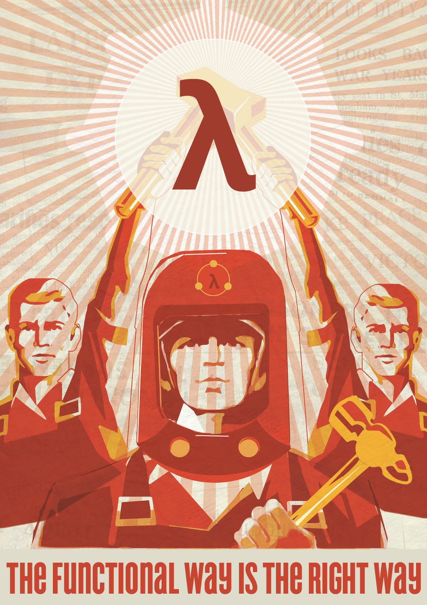

# Functional Programming Resources

## Basics

[What is Functional Programming? - Kris Jenkins](http://blog.jenkster.com/2015/12/what-is-functional-programming.html)

## Books

[Mostly Adequate Guide to Functional Programming](https://github.com/MostlyAdequate/mostly-adequate-guide)

## Podcasts

[Functional and Immutable Design Patterns in JavaScript - JavaScript Air](https://javascriptair.com/episodes/2015-12-30/)

## Channels

[funfunfunction](https://www.youtube.com/channel/UCO1cgjhGzsSYb1rsB4bFe4Q)
