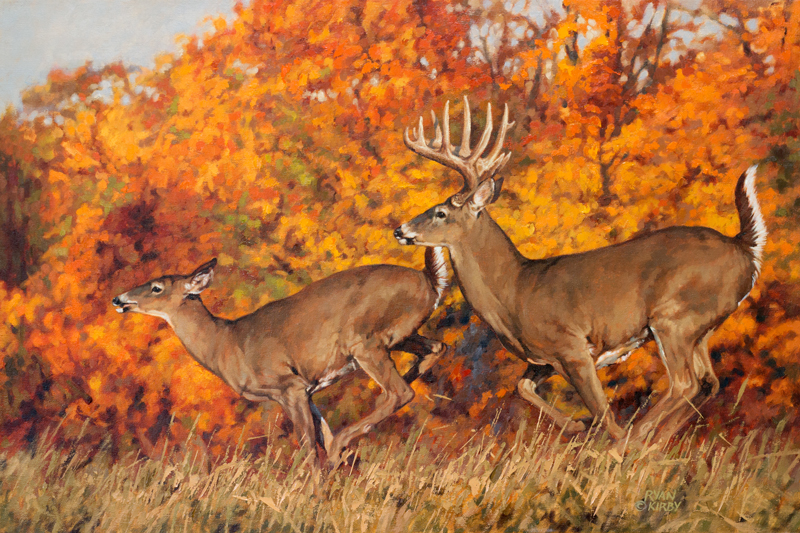

# The Deer Lecture

## Timeline

- 1850 - First closed season for Deer
- 1910 - Deer populations drop to record low numbers
- 1927 - No open season in alternate years
- 1943 - First doe and fawn season in 24 years
- 1962 - Deer population above 400,000

##Wisconsin's Efforts

- Conservation Congress formed in 1933, deer management is usually the biggest topic
- Developed advanced techniques for modeling deer populations
- Mandatory deer registration

##Overabundance
- Deer collisions are dangerous and correlate very well with deer population
- Note enough hunters to kill enough

##How to Handle

- Increase harvest by raising bag limit
- Skew sex ratio and hunt more does

##Chronic Wasting Disease

- Disease is rapidly increasing due to large deer population
- Changed policy to reflect how to manage techniques

## Now

- Recently changed lots of laws with respect to this
- Now deer numbers are set politically rather than scientifically

> Thanks to Wisconsin Governor Scott Walker, Pennsylvania can now claim to have the best deer managment program in the country
