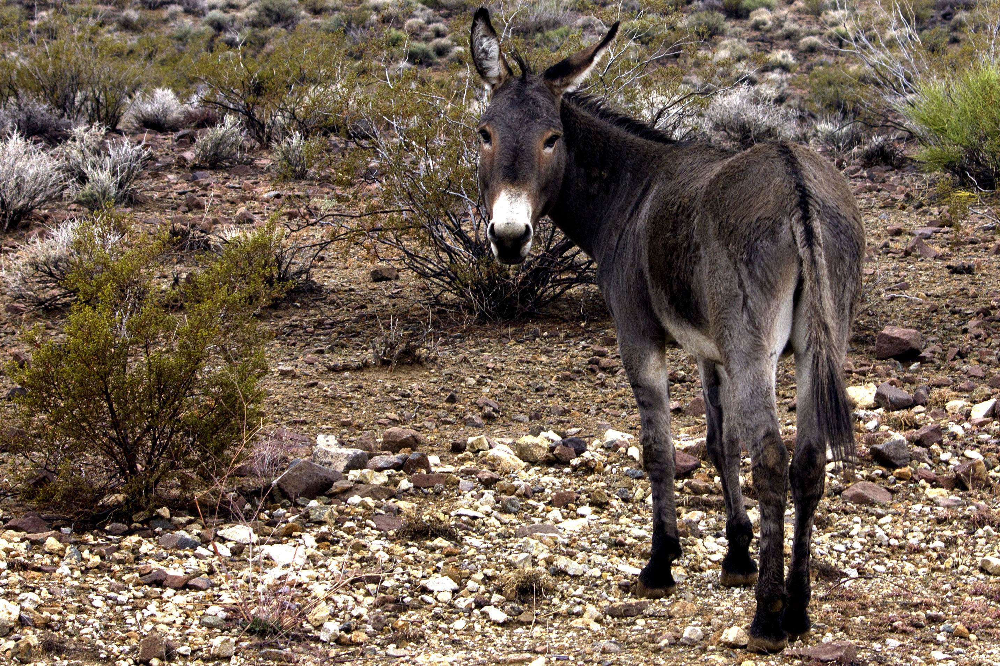

#Exotics and Invasive Species

## Human Agency

 - Deliberate introduction
 - Inadvertent introductions
 - Natural colonization

Not all exotics become established after initial arrival, but invasive species often do

## Ecological Consequences

- Loss of biological diversity through extinctions, shifts in abundance
- Predation, competition, disease, parasitism
- Especially islands, they get decimated

## Fail

British navy tried to put goats and rabbits on uninhabited islands to help shipwrecked sailors. That didn't go well.

##Stan's Fight for Species

- Stan wanted to eliminate the rabbits and goats to save the unique species on the island
- People protested and said:

>We would rather see the elimination of all of the endemic species on Round Island than have you kill the goats and rabbits.

## What is Being Done

- Some of the worst agricultural pests are on USDA 'blacklist'
-Congress is much more focused on human immigration
- Not much gets done

## War on Cats

- Extremely invasive, kill lots of birds
- Got Prof. Temple into hot water over killing them
- People's 'cat friendly' initiatives are not effective
- Stan has his own recommendations, largest is to keep cats indoors 
