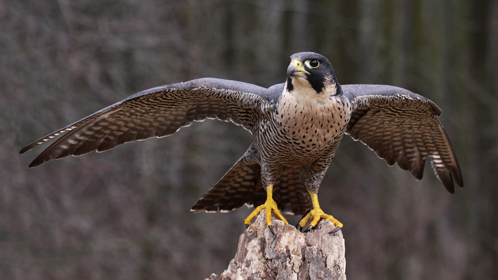

#DDT and Its Wrath

## Pesticides

  - Synthetic chemicals
  - Persistent, stored in animal lipids
  - DDT

##Peregrine falcon

  - One of the most prevalent birds, across the world
  - In 1964 they started to go away

  Conference held in Madison about their disappearance.

  Captive falcon was observed for a long time by ornithologists. Noticed clear change when DDT became a factor.

  The falcons were breaking their eggs, which birds do not normally do. Eggshell thickness declined suddenly after 1946. DDT became widespread in 1945 as the go to pest killer sprayed on crops when you have a problem. Also sprayed by homeowners to get rid of them in your home.

  In 18 years, entire population of East Rockies was wiped out.

### Banning of DDT

  Wisconsin played an integral part. In 1972 it was banned.

### Chemicals are Still a Threat

- Pesticides
- Lead
- Mercury
- Drugs
- Carbon
