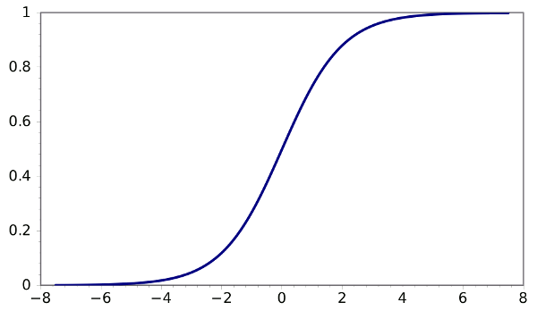

#4 Fundamental Goals of Wildlife Management

##Human Exploitation

### Overexploitation
Use to much, reduce population.

###Sustainable-Exploitation
Use to match births and deaths

##Key role of Density Dependence

Reductions in population density trigger predictable responses.

It is the **increment of growth** that can be harvested sustainably.

It is equal to r times N

Analogous to endowment that earns interest

Because of slope of Sigmoid graph of population, you can harvest more animals in a sustainable fashion if you do so when the population is in the middle of its Sigmoid graph, where the slope (rate of growth) is higher.

##Essential Information

* N - population size/density
* K - carrying capacity
* r - intrinsic rate of growth
