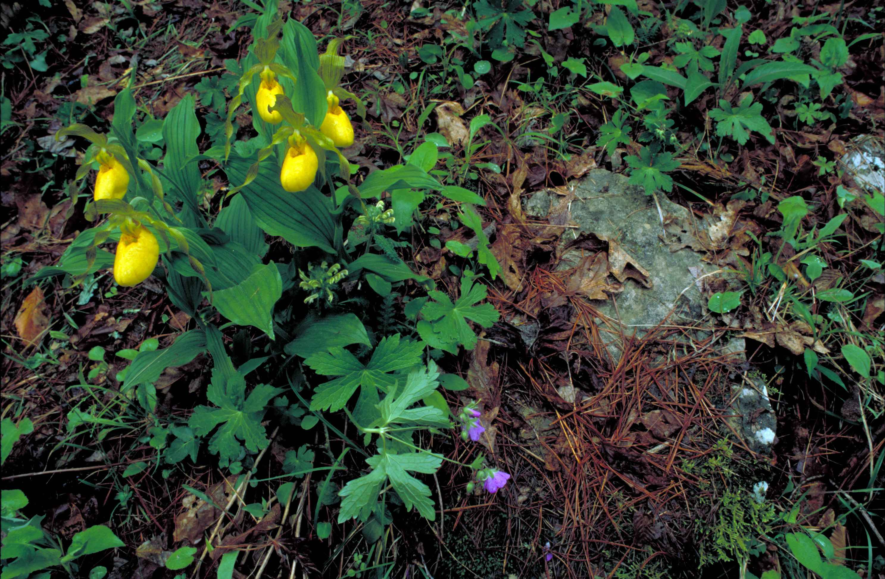

#Conservation Biology

Neglecting affect is no longer useful in a human dominated world where our impacts are pervasive

Has its roots in Aldo Leopold and others of the time, but didn't gain recognition until the late 1970's

We are losing species at an incredible rate, more than a million since the 1600's. Average rate before humans: 1 per year (excluding mass extinction events).

Review on slides! Sorry!
