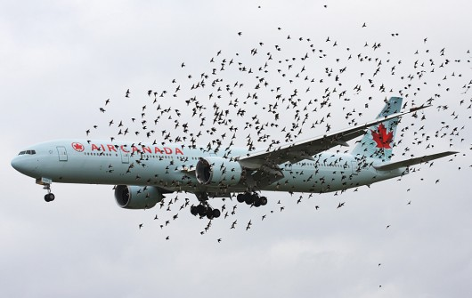

#Principles of Controlling Overabundant Wildlife

## Is wildlife too abundant?
The answer is a qualified 'yes'.

### Four Major Reasons When Too abundant

- When animals threaten human life or livelihood
- When animals depress the abundance of a favored species
- When animals are too numerous 'for their own good'
- When animals are causing undesirable changes in the ecosystem

## What should managers do?

Reduce population size, in a responsible way. In other cases, prevent the animals from causing the conflict (repellants, barriers).

Important to note that reductions in pop size may have cascading effects.

## Who determines acceptable pop size?

Different people have different opinions based on how much it is affecting them. Often heated disagreement. Cost-benefit analysis often shows control efforts are not worth it.

## Types of control

- Lethal
- Birth control
- Animal relocation

## Bottomline

Reductions in pop size trigger growth that must be removed. Requires frequent killing or cost ineffective reproduction or relocation.

## Alternatives

Reduce the animal conflicts!

### Types

- barriers (fences)
- impose limiting factor (limit water for starlings in winter)
- repellants
  - some are scams though (ultrasonic)
-guard animals

### Bottomline of Alternatives

Problems with almost all of these. No cure-all solution. Regardless of what you do, do it in a targeted way so as not to have unintended consequences. 
