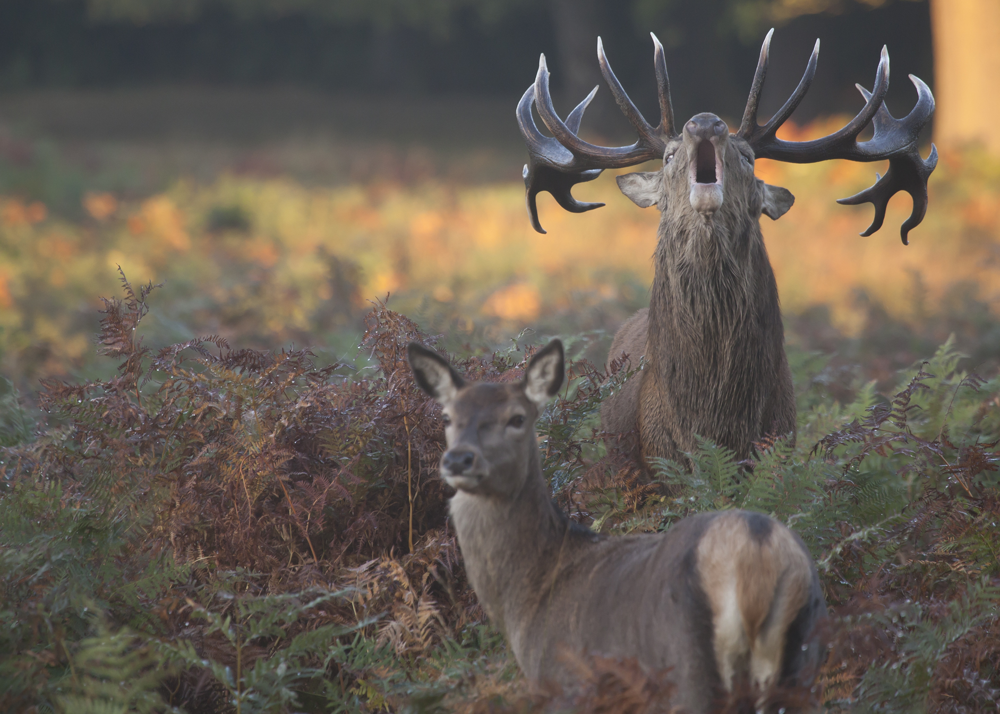

# Review Material

## Overabundance

Is wildlife overabundant? A qualified yes

### Why

1) When animals threaten human life or livelihood
  - aircraft collision
  - property damage
  - damage to crops/livestock
  - transmit deadly diseases
  
2) When animals depress the abundance of a favored species
3) When animals are too numerous for their own good
4) When animals are causing undesirable changes in the ecosystem

### What to do

- Manipulating mortality, reproduction, emigration
  - requires constant effort
  - many of our pests are r-selected and thus hard to keep at bay
- Relocation or reproductive control
  - expensive
- Alternatives: exclude animals, impose limiting factor, modify behavior
  - Can be effective depending on case
  - Success: barriers, starlings and water feedlots
- Repellants
  - physical can be popular and effective
  - ultrasonic ones are bull
  - chemical repellents, biotic repellents, threats of predation, guard animals

### Bottom Line

There is no cure all. Several of the techniques are expensive or labor intensive. Often control is very controversial.

## Deer

- Have gone from rare to overabundant
- Population began increasing in 1930's after gross over killing in the late 19th century
- Conservation Congress formed in 1933 for citizens to have input on hunting
- By the 1960's there was a clear overabundance
- At that time, innovative methods to deal with issue (sex-age-kill), set density goals on ecological basis
- Still very overabundant, many deer collisions and chronic wasting disease
- Hard to meet management goals since season is too short and people don't want to kill does and fawns
- Scott Walker cut a lot of management resources, greatly put back Wisconsin's policies and removed us from being a leader in management

## Exotics

- Alien, non-indigenous, non-native, introduced, immigrant species
- May come with humans deliberately or be stowaways
- Not all exotic species become established, but invasive ones often do
- Leads to loss of biological diversity
- Predation, competition, disease, parasitism, habitat alteration allow invasive species to displace native ones
- Guam snake killed all 12 bird species
- Hawaiian crows are getting screwed as well
- Round Island (never forget!)
- People often oppose eliminating exotics because it means mass killing
- Global commerces provides ample opportunities in modern day for exotics
- They have played a significant role in extinctions and pose a threat to endangered species
- Biological controls can run amok, killing is controversial
- Thus, prevention is key
- No real policy to deal with
- Rats and cats are the worst
- Cats kill a lot of birds, but people like them so ya know, probably will never get dealt with
- Stan's 3 Way Test
  - Would it effectively control free-ranging cat pops?
  - Would it avoid causing ecological harm?
  - Would it be acceptable to most people?
- Really should keep cats indoors

## Rare and Endangered species

- There has been a huge increase in endangered species worldwide
- There are 2 lists: one made by international body, and the one that is enforceable by law
- International standard is better, based on science
- Endangered Species Act of 1966
- Put in to law when people noticed lots of things were going extinct
- U.S. Fish and Wildlife Service, National Marine Fisheries Service, U.S. Geological Survey
- First petition must be filed, ESA evaluates on specific criteria, pulls species from the candidate lists
- Recovery plans are produced, recovery team choses critical habitat area
- All agencies have accountability
- 90% are recovering, very successful
- Ultimate and Proximate causes
- If below K, population can easily be increased
- If at K, must remove limiting factors
- Reduce 'normal losses' to reduce mortality
- Bring more species to the area
- Where N < K, high mortality is usually problem

## Peregrine Falcons (A whole lecture?)

- DDT from pesticides was highly persistent in the birds
- One of the most birds in the world, by 1964, were endangered
- 1965 Peregrine conference in UW Madison
- Eggshell thickness decreased, they were breaking their eggs
- DDT Banned in 1972
- Began breeding in captive
- DDT magnifies as it moves up the food chain
- Osprey's had same problem, were recovered by donor pairs in non-effected regions
- Must be careful of pesticides, lead, mercury, drugs and of course, carbon

## Conservation Biology

- for just normal non threatened species, Laissez-faire is not appropriate in a human dominated world
- Focuses on protecting and restoring biodiversity
- Encompasses genes, species, and communities/ecosystems
- Roots can be traced to Aldo Leopold
- Genetic variation indicates health of a species
- Species are viewed as the fundamental unit of biodiversity
- Extinction rate is usually about 1 species per year, with humans 10,000 per year
- Goals
  - Maintain genetic diversity
  - Maintain viable populations of all native species
  - Maintain the richness, composition and relative abundance of native species in natural communities
  - Maintain natural ecosystem patterns
- Living Planet Index has decreased 30% globally
- Some schools view it as pieces vs one living land
- Field has become mainstream, hard to catalog, inventory and understand though
- IN SITU - protected areas, sacred forests and lakes
- EX SITU - seed banks, captive breeding, translocation, zoos

## Protected Areas

- One of tenants of maintaining biodiversity: protection, conservation, restoration
- Originally intended for scenic beauty and recreation
- Thus wasn't useful or representative for protection
- A geographically defined area which is designated, regulated, and managed to achieve specific conservation objectives
- Represent and protect ecological systems of the area
- Great urgency, within our life time there will be no more regions
- Select for full representation, design to ensure long term viability, manage to reduce threats
- Overall goal to achieve good representation of world's biodiversity
- < 3% of Earth's surface can significant (~ half) of the worlds biodiversity (big bang for buck)
- 6 Levels of Protection:
  - Strict Nature Reserve
    - protected area managed for biodiversity protection and scientific study, Aldabra Island
  - Wilderness Area
    - protected area managed mainly for wilderness protection, Arctic National Wildlife Refuge
  - National Park
    - protected area managed mainly for ecosystem protection and recreation, Yellowstone National Park
  - Natural Monument
    - Protected area managed mainly for conservation of specific natural features, Giant Sequoia National Monument
  - Habitat/Species Management Area
    - Protected area managed mainly for conservation through management intervention, Horicon Marsh
  - Protected Landscape/Seascape
    - Protected area managed mainly for landscape/seascape conservation and recreation
  - Managed Resource Protected Area
    - protected area managed mainly for the sustainable use of natural ecosystems, US National forests
- 161,000 worldwide, > 10% of Earth's surface
- 27% of us is under some Levels
- Principles of Design
  - Bigger > smaller
  - One > many
  - Close > far
  - Circularly arranged > Line
  - Connected > apart
  - grouped tightly > loosely
- Size is important, as are natural boundaries
- Multiple levels of protection to encompass large areas
- buffer zone is good
- must also manage internal threats
- No great international plan or national policies to protect all endangered ecosystems
